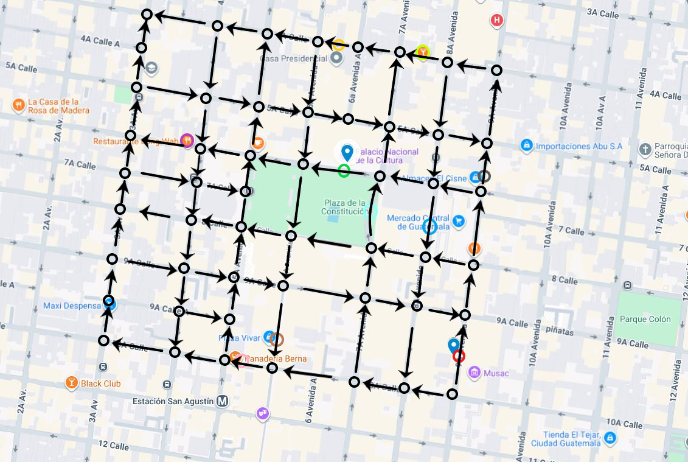
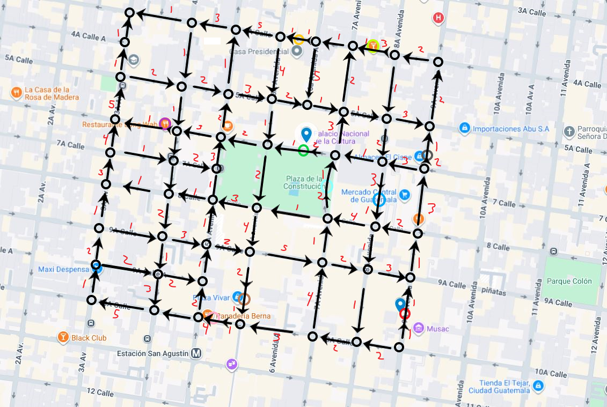

# mini_waze
Se implementara un sistema básico de navegación usando grafos para representar mapas, permitiendo calcular rutas óptimas entre puntos y simular el funcionamiento de un GPS sencillo.

Se escogió la Zona 1 como área de practica, abarcando específicamente desde la 4a calle hasta la 10a calle y desde la 3a avenida hasta la 9a avenida.

## Grafo de ubicaciones

En este repositorio ya se incluye el grafo completo, con sus nodos y direcciones (aristas dirigidas).  
El grafo tiene **57 nodos**, de los cuales **10 son nodos de tipo _location_**, cada uno identificado por un color:

- **Rojo**: Congreso  
- **Verde**: Palacio Nacional  
- **Amarillo**: Casa Presidencial  
- **Morado**: Restaurante Long Wang  
- **Cyan**: Plaza de la Constitución  
- **Celeste**: Mercado Central de Guatemala  
- **Rosado**: Panadería Berna  
- **Café**: Plaza Vivar  
- **Verde claro**: Bar de Vic  
- **Gris**: Almacenes Cisne  

Estos colores se utilizan en las visualizaciones del grafo para distinguir rápidamente cada ubicación.

### Pesos del grafo
- Los **pesos base** de las aristas están en el rango **1 a 5**.  
- Estos valores representan el costo o tiempo de movimiento **sin tráfico**.

### Lógica de tráfico
Cuando se activa el modo **con tráfico**:
- Los pesos pueden **incrementarse dinámicamente**.  
- Cada peso puede **duplicarse**, alcanzando un máximo de **10**.  
- Esto permite simular rutas más lentas, congestión y variabilidad realista en el sistema.
